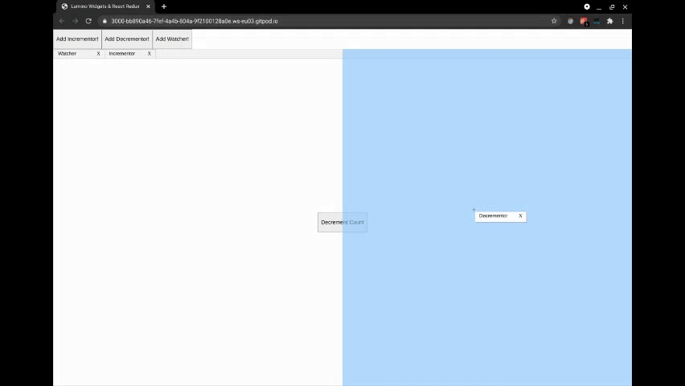

# Lumino Widgets + React/Redux

This project is an example on how to use `@lumino/widgets` in a React application. Inspired by [vue-lumino](https://github.com/tupilabs/vue-lumino).

The goal was to have a window management similar to VSCode's, but keep access to Redux State and add new windows via Redux actions. In order to realise this we have keep in mind, that `lumino` (formerly `phosphorjs`) manages the windows outside of React.

All the magic happens in `Lumino.tsx` & `widgetsSlice.ts`.

Steps to reproduce:
- Decide what will be a widget in your app, define props for these widgets
    - In my case its `{id: string, name: string}`, where the ID is used to add/remove a specific widget and the name will be displayed in the tab.
- Define a redux state for the widgets
    - I wrote my Redux widget handling in `widgetsSlice.ts` using the modern `@redux/toolkit` which I love. Each supported widget has its own type that will be used for telling lumino which React component to render.
- Inherit from luminos `Widget` class
    - We use our custom class to handle communication between lumino and React through custom events.
- Initialize luminos `Boxpanel` and `DockPanel` during the first render in a `useEffect` hook. Attach callbacks to the elements custom events to communicate our custom widgets events back to react.
- Watch the redux widgetstate and add a new widget to the `DockPanel` when a new widget appears in the state.

## Styling

To my opinion custom styling is a rather difficult process when using lumino. But with your browsers DevTools it should be okay. For this demo I replaced the close icon with an "X" and changed the window overlay preview to be blue. Change them add your styles in `Lumino.css`.

## Will there be a package?

I have no plans on making this a package, since this is an early proof of concept that will be the base for a production app. Also I never created a React package and might need some advice. So I decided to leave this a template with instructions on how to integrate `@lumino/widgets` into your react app.

## Contributing

I am happy for any feedback or better ideas on how to improve the integration of `@lumino/widgets` into React/Redux. Feel free to file an Issue or a PR :)
